# PatchPilot — User Manual

*Patch management for Linux, macOS, and Windows fleets, in one dark-themed dashboard.*

---

## Table of Contents

**Part I — Why PatchPilot?**
- [What it is](#what-it-is)
- [Who it's for](#who-its-for)
- [What problem it solves](#what-problem-it-solves)
- [How it compares](#how-it-compares)

**Part II — For Administrators (Install & Operate)**
1. [Prerequisites](#1-prerequisites)
2. [Install — Web Installer (UI wizard)](#2-install--web-installer-ui-wizard)
3. [Install — Docker Compose (CLI)](#3-install--docker-compose-cli)
4. [Install — K3s / Kubernetes](#4-install--k3s--kubernetes)
5. [First-run setup wizard](#5-first-run-setup-wizard)
6. [Users & roles (RBAC)](#6-users--roles-rbac)
7. [Backup & restore](#7-backup--restore)
8. [In-app updates](#8-in-app-updates)
9. [Licensing & trial](#9-licensing--trial)
10. [Advanced settings](#10-advanced-settings)
11. [Uninstall](#11-uninstall)

**Part III — For Operators (Day-to-day Use)**
12. [Dashboard tour](#12-dashboard-tour)
13. [SSH keys library](#13-ssh-keys-library)
14. [Adding hosts](#14-adding-hosts)
15. [Onboarding Linux & Windows hosts](#15-onboarding-linux--windows-hosts)
16. [Checking for updates](#16-checking-for-updates)
17. [Patching](#17-patching)
18. [Scheduled patch windows](#18-scheduled-patch-windows)
19. [Package exclusions](#19-package-exclusions)
20. [The iOS app](#20-the-ios-app)
21. [Troubleshooting](#21-troubleshooting)

---

# Part I — Why PatchPilot?

## What it is

PatchPilot is a self-hosted patch-management dashboard. It connects to your Linux, macOS, and Windows machines over SSH, asks each one what updates are pending, shows you the answers in a single dark-themed web UI, and lets you push patches — manually, on a schedule, or one click from your phone — while streaming the live Ansible output so you can actually see what's happening.

It runs as a small set of containers (PostgreSQL, FastAPI backend, Nginx frontend). One host, one LAN, or a full K3s cluster — same app, same workflows.

## Who it's for

- **Homelab operators** with a handful of mixed Linux / macOS / Windows boxes who are tired of `apt update && apt upgrade` over SSH one host at a time.
- **Small IT teams** who want fleet visibility without standing up a full RMM stack (Tanium, BigFix, Intune) or wiring together Ansible Tower / AWX / Semaphore by hand.
- **MSPs and freelance sysadmins** managing a few dozen client machines who need a dashboard they can hand to a junior — or to the client — without exposing the underlying playbooks.
- **Mac-heavy shops** that need a tool which actually understands `brew`, `mas`, *and* `softwareupdate` instead of pretending macOS doesn't exist.

## What problem it solves

Patching a fleet by hand is a slow, error-prone game of "who did I forget?" You SSH into a box, run the right command for *that* OS (`apt`, `dnf`, `brew`, `winget`...), watch it scroll, hope the reboot stuck, then do it again on the next box. Schedule it via cron and you lose visibility. Use a heavyweight RMM and you bring in agents, MDM enrollment, and a procurement cycle.

PatchPilot fills the middle ground:

- **Agentless** — pure SSH, no software to install on managed hosts beyond a service user and a scoped sudoers rule.
- **Multi-platform** — one dashboard for `apt`, `dnf`/`yum`, `brew` + `mas` + `softwareupdate`, and `winget` + `PSWindowsUpdate`.
- **Real-time** — live WebSocket streaming of Ansible task output, so a stuck patch shows you *which* package is stuck.
- **Encrypted at rest** — SSH private keys and sudo passwords stored with Fernet (AES-256). The key lives in an environment variable, never the database.
- **Self-hosted** — your hosts, your network, your data. No SaaS, no agent phoning home.
- **Cheap** — $5.99/month or $49/year after a 14-day free trial. No per-host pricing.

## How it compares

| | PatchPilot | Manual SSH | AWX / Semaphore | Tanium / BigFix |
|---|---|---|---|---|
| Setup time | ~10 min | 0 | hours | weeks |
| Multi-OS in one view | ✅ | ❌ | ⚠️ (you build it) | ✅ |
| Live progress streaming | ✅ | ✅ | ⚠️ | ✅ |
| Agentless | ✅ | ✅ | ✅ | ❌ |
| Scheduled windows | ✅ | crontab | ✅ | ✅ |
| Real-time mobile app | ✅ | ❌ | ❌ | ⚠️ |
| Price (50 hosts) | $49/yr | free | free (your time) | $$$ |

---

# Part II — For Administrators

## 1. Prerequisites

| Need | Why |
|---|---|
| A Linux/macOS host with Docker (or a K3s cluster) | Where PatchPilot runs |
| Python 3.8+ | Installer parses YAML config |
| SSH access to every host you want to patch | PatchPilot is agentless — SSH is the contract |
| (Optional) A domain + Cloudflare account | For HTTPS on K3s via DNS-01 |
| (Optional) A LemonSqueezy or Freemius license key | After the 14-day trial |

PatchPilot does **not** require root on the PatchPilot host (it does require the running user to be in the `docker` group on Linux). On *managed* hosts, it uses a scoped `NOPASSWD` sudoers fragment — never `ALL`.

## 2. Install — Web Installer (UI wizard)

If you'd rather click through a browser-based setup than memorize CLI flags, PatchPilot ships a local web wizard. It collects everything it needs through a series of pages, then runs the real installer in the background and streams the output back to your browser.

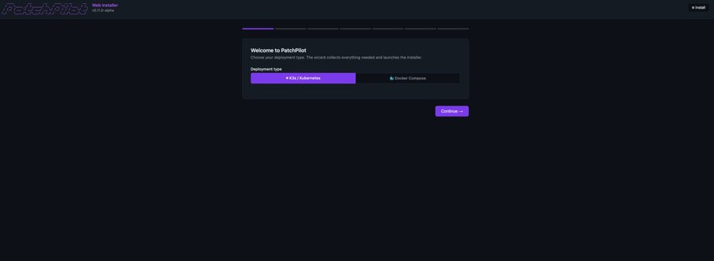

### Launch the wizard

```bash
git clone https://github.com/linit01/patchpilot.git
cd patchpilot
./install.sh --web
```

The script creates a Python venv under `webinstall/`, installs FastAPI + uvicorn, and starts the wizard on **`http://localhost:9090`**. The first page asks which deployment mode to use — **Docker Compose** for a single host, or **Kubernetes** for cluster deployment. The page also runs a live Docker readiness check so you know up front whether Docker Desktop is installed and running on your machine.

### What the wizard collects

The pages you'll see depend on the mode you pick:

| Page | Shown for | What it asks |
|---|---|---|
| **Welcome / Mode** | Both | Docker Compose vs. Kubernetes; warns that k3s install is your responsibility |
| **Kubernetes cluster** | k3s only | kubeconfig context, namespace, storage class |
| **Docker Hub** | Both | Image tag / registry (defaults to `linit01/patchpilot:<version>`) |
| **Network & TLS** | k3s only | Hostname, additional hostnames, cert-manager email, Cloudflare DNS-01 token |
| **Storage** | Both | PostgreSQL storage class, backup volume / NFS path, retention count |
| **Application Settings** | Both | App title, timezone, default SSH user/port, dashboard refresh interval |
| **Review & Deploy** | Both | Confirms every value before applying |

For Kubernetes, the wizard writes `k8s/install-config.yaml` from your answers, then invokes `install.sh --k3s` under the hood. For Docker Compose, it writes `.env` and runs `install.sh --docker`. In both cases, output streams live to a console pane on the final page (Server-Sent Events) — same lines you'd see if you ran the installer in a terminal.

### When deploy finishes

The success page shows the dashboard URL as a clickable link. Click it and you land in the [first-run setup wizard](#5-first-run-setup-wizard) inside PatchPilot itself.

### Uninstall via the wizard

Append `?uninstall=1` to the wizard URL (or use the **Uninstall PatchPilot** link in the footer) for a guided removal of all containers / cluster resources. Same scope as the CLI `./install.sh --k3s --uninstall`.

### Developer mode

`./install.sh --web --developer` enables a hidden **Build & Push Images** tab in the wizard for contributors who want to build images from local source before deploy. Skip this — it's for people working on PatchPilot itself, not running it.

---

## 3. Install — Docker Compose (CLI)

The fastest path. Single host, accessible on `http://<host>:8080`.

```bash
# One-liner (clones or pulls a release tarball, runs the installer)
curl -fsSL https://getpatchpilot.app/install.sh | bash

# Or do it by hand
git clone https://github.com/linit01/patchpilot.git
cd patchpilot
./install.sh --docker
```

What the installer does:

1. Verifies Docker is running and your user can use it.
2. Generates a Fernet encryption key.
3. Writes `.env` (DB password, encryption key, install dir, base URL).
4. Pulls `linit01/patchpilot:backend-<ver>` and `:frontend-<ver>` from Docker Hub.
5. Starts PostgreSQL 15, the backend, and the frontend.
6. Prints the dashboard URL.

Then open the URL and proceed to the [first-run setup wizard](#4-first-run-setup-wizard).

**Developers** building from local source instead of pulling images:

```bash
./install.sh --docker --developer
```

## 4. Install — K3s / Kubernetes

For production-grade deployments with HTTPS, persistent storage, and a real ingress.

**You need:** `kubectl` pointed at your cluster, `python3 -m pip install pyyaml`, Traefik (ships with K3s), and cert-manager.

**Step 1** — If you're using DNS-01 (required for `.lan` hostnames or any internal name):

```bash
kubectl create secret generic cloudflare-api-token-secret \
  --from-literal=api-token=YOUR_CF_TOKEN \
  -n cert-manager
```

Token needs **Zone → DNS → Edit** on your domain.

**Step 2** — Edit `k8s/install-config.yaml`:

```yaml
patchpilot:
  network:
    hostname: patchpilot.yourdomain.com
    additionalHostnames:
      - patchpilot.lan
  certManager:
    email: you@yourdomain.com
    cloudflare:
      email: you@cloudflare.com
  postgres:
    storageClass: "app-data"
  storage:
    storageClass: "app-data"
```

Leave passwords and the encryption key blank — they're auto-generated.

**Step 3** — `./install.sh --k3s` and wait for the rollout.

The installer renders manifests to `k8s/.generated/`, applies them in dependency order (namespace → secrets → PVCs → DB → backend → frontend → ingress → certificate), and waits for `Ready=True` on every deployment.

Full guide: see `KUBERNETES.md`.

## 5. First-run setup wizard

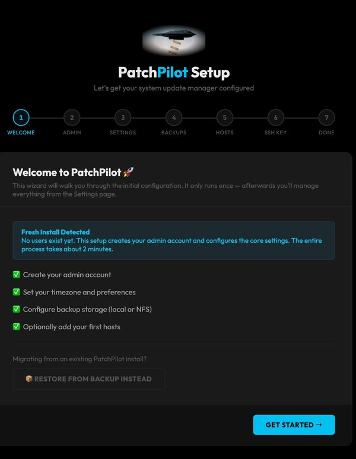

The first time you hit the dashboard URL, you'll be redirected to `setup.html` — an 8-step wizard:

1. **Welcome** — explains what you're about to do.
2. **Admin account** — username (≥3 chars) and password (≥8 chars). This account becomes the **Full Admin** (see RBAC below). There is only ever one.
3. **General settings** — app title, timezone (IANA), site URL (used for CORS and outbound links), dashboard refresh interval (60s–30m, default 5m), and default SSH user / port for new hosts (defaults `root` / `22`).
4. **Backup storage** — local Docker volume or NFS (server + share path). Retention defaults to 10 archives.

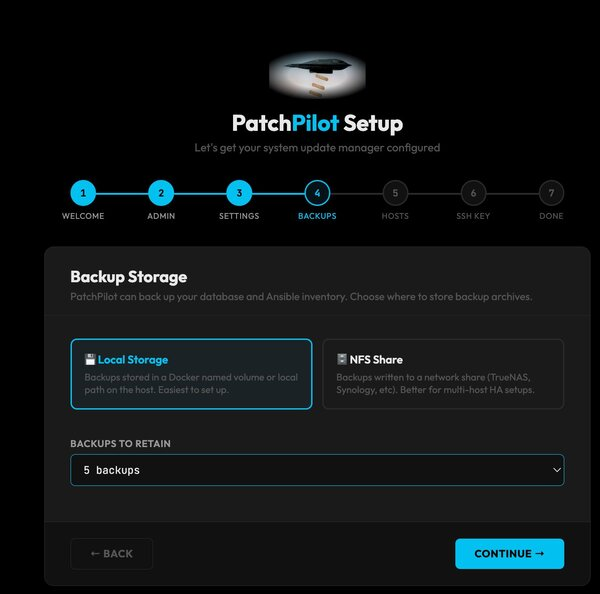
5. **SSH key** — optionally upload a default private key now. You can also add it later in Settings → SSH Keys.
6. **First hosts** — optional. You can add hostnames here; key and password come later.
7. **License** — optionally activate now, or skip and use the 14-day trial.
8. **Finish** — everything is written atomically, your session cookie is issued, you land on the dashboard.

Once *any* user exists, `setup.html` becomes inaccessible. All further configuration happens through Settings.

> **Restoring from a backup?** On step 1 there's a "Restore from Backup Instead" option. Upload a `.tgz`, the wizard imports the DB, ansible files, and (optionally) the encryption key, then restarts the backend.

## 6. Users & roles (RBAC)

Three roles, decided at user-creation time. Manage them in **Settings → Users** (Full Admin only).

| Role | Sees | Can edit | Notes |
|---|---|---|---|
| **Full Admin** | All hosts, keys, schedules, users, backups | Everything | Exactly one per installation — the account from setup |
| **Admin** | Only their own resources | Their own resources | Can add hosts, keys, schedules, run patches |
| **Viewer** | All resources (read-only) | Nothing | Sees the dashboard and host details. Cannot patch, edit, or delete |

Sessions are cookie-based (`patchpilot_session`, HttpOnly, SameSite=Lax, 24-hour expiry, Secure flag set when serving over HTTPS). Failed logins are audited. Viewers receive HTTP 403 on any mutating endpoint.

## 7. Backup & restore

**Settings → Backup & Restore.** Requires an active license (trial users see a lock overlay).

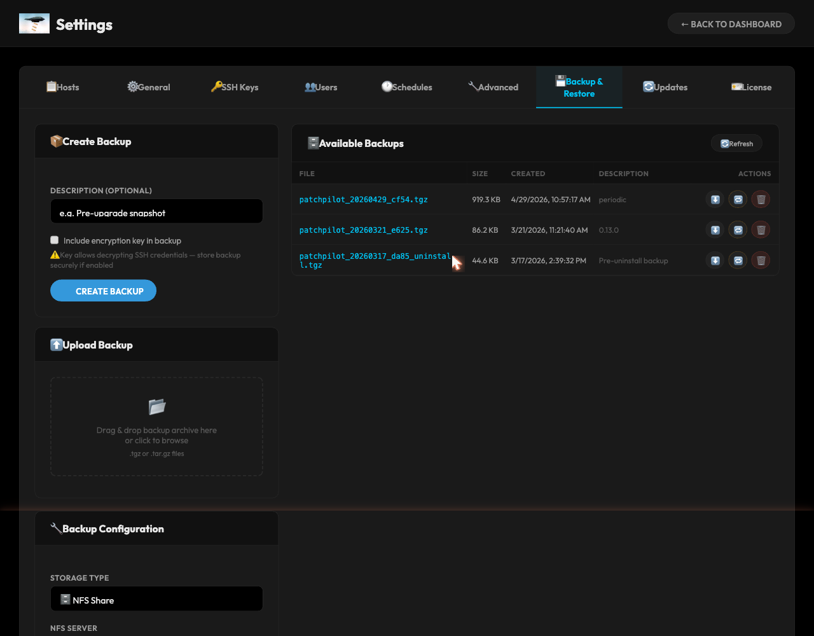

### What's in a backup

- Full PostgreSQL dump (custom binary format from `pg_dump`)
- Settings JSON
- Ansible playbooks and inventory
- Optionally, the Fernet encryption key (in a sidecar `*.key.json` file)

Backups are written to `/backups` inside the container (either a Docker volume or an NFS mount, depending on what you chose at setup). Files are timestamped, e.g. `patchpilot_20260520_185509.tar.gz`.

### Creating one

Click **Create Backup**. The backend:

1. Enters maintenance mode (rejects new patches and check requests).
2. Quiesces the DB by terminating other connections.
3. Runs `pg_dump`.
4. Bundles everything into a `.tar.gz`.
5. Applies retention — keeps the last `backup_retain_count` archives (default 10), but **never** evicts the last key-bearing backup, and **never** counts uninstall backups against the quota.
6. Leaves maintenance mode.

### Restoring

Two paths:

- **In-app** (Full Admin only): upload a `.tgz` in Settings → Backup & Restore, or click **Restore** on a listed backup. The backend drops & recreates the DB, restores it, syncs the encryption key, and restarts.
- **Post-install**: on the setup wizard's first screen, click "Restore from Backup Instead" and upload the archive.

After restoring, an immediate fleet check kicks off to refresh host status.

> **Encryption key warning:** if you restore on a *new* installation with a different Fernet key, all stored SSH keys and sudo passwords will be unreadable. Always retain the standalone `*.key.json` sidecar alongside backups.

## 8. In-app updates

PatchPilot checks GitHub Releases every 24 hours (configurable in Advanced settings, minimum 1 hour). When a new version is available, a badge appears on the sidebar.

**Settings → Updates** shows the available version with release notes and an **Update Now** button.

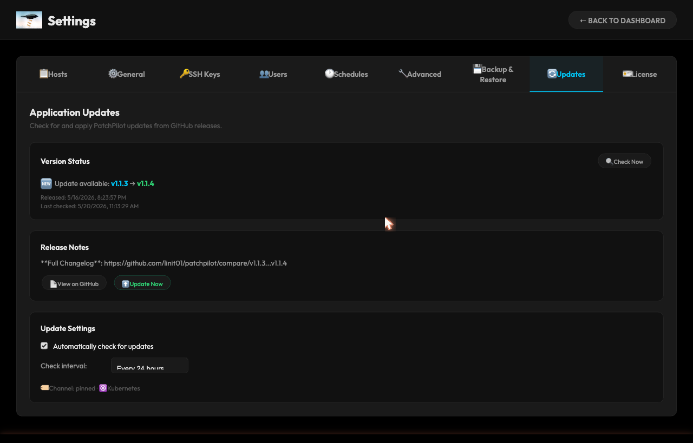

- **Docker Compose mode:** the backend rewrites image tags in `docker-compose.yml`, pulls the new images, and spawns a helper container to restart services. The frontend auto-reconnects.
- **K3s mode:** the backend uses its in-cluster ServiceAccount token to `set image` on the backend and frontend deployments and trigger a rollout. No `kubectl` binary required.

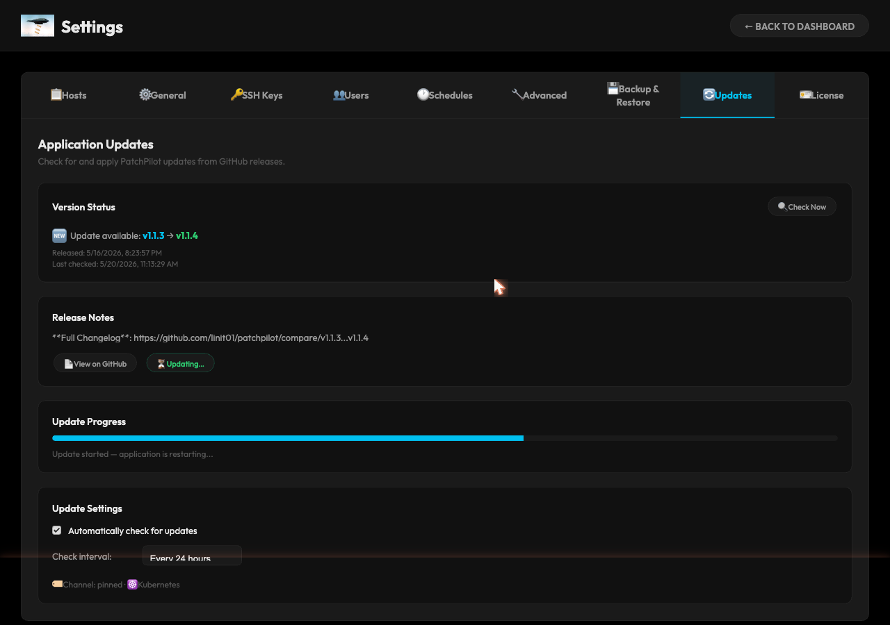

You can always update manually:

```bash
# Docker
docker compose pull && docker compose up -d

# K3s
kubectl -n patchpilot set image deployment/patchpilot-backend \
  backend=linit01/patchpilot:backend-1.1.4
kubectl -n patchpilot rollout restart deployment/patchpilot-backend
```

## 9. Licensing & trial

PatchPilot starts in a **14-day free trial** on first-run setup. Everything works except backup/restore.

### Activating

**Settings → License**, paste your key (UUID format from LemonSqueezy or Freemius), click **Activate**. The backend validates with the provider, binds the key to your installation's UUID, and stores the result.

### Moving the license

Each key activates on one installation. To move:

1. On the old installation: **Settings → License → Deactivate**.
2. On the new installation: **Activate** with the same key.

### Periodic validation

The backend re-validates every 7 days. If the provider is unreachable, you get a 30-day **grace period** before the license is treated as expired. Expired or admin-disabled licenses block patching but never lock you out of the dashboard.

### Buying

[getpatchpilot.app](https://getpatchpilot.app) — $5.99/month or $49/year (no per-host pricing).

## 10. Advanced settings

**Settings → Advanced.** Most knobs are safe defaults; here are the ones you'll actually touch:

| Setting | Default | Notes |
|---|---|---|
| `debug_mode` | `false` | Verbose backend logging. Toggles at runtime, no restart |
| `refresh_interval` | `300` (5 min) | Background fleet-check cadence; also dashboard poll rate. `0` disables periodic checks |
| `macos_system_updates_enabled` | `false` | Run `softwareupdate` on macOS hosts. Test before enabling fleet-wide |
| `mas_enabled` | `false` | Apply Mac App Store updates via `mas`. Requires GUI login |
| `winupdate_enabled` | `false` | Apply Windows Updates via `PSWindowsUpdate` |
| `update_check_enabled` | `true` | Whether to poll GitHub for new releases |
| `update_check_interval` | `86400` | Min `3600` |
| `app_base_url` | from setup | Used for CORS and the canonical URL in links |
| `allowed_origins` | `*` | Comma-separated CORS allowlist |
| `schedule_timezone` | IANA from setup | Cron evaluation timezone |

## 11. Uninstall

Full Admin only. **Settings → Advanced → Uninstall**, or `POST /api/uninstall/{mode}`.

- **Docker:** stops and removes the Compose project's containers, named volumes (backups + postgres data), and built images. Leaves the installation directory in place — delete it yourself if you want it gone.
- **K3s:** deletes the `patchpilot` namespace (all Deployments, Services, PVCs, Secrets). Uses the in-cluster ServiceAccount.

A pre-uninstall backup is created automatically; it's excluded from retention so it sticks around.

---

# Part III — For Operators

## 12. Dashboard tour

The first thing you'll see is the sign-in page. Below the login form, a public read-only **System Status** panel shows fleet-wide counts and a per-host status list — so other people in your org can glance at the URL and know if patches are pending, without needing an account.

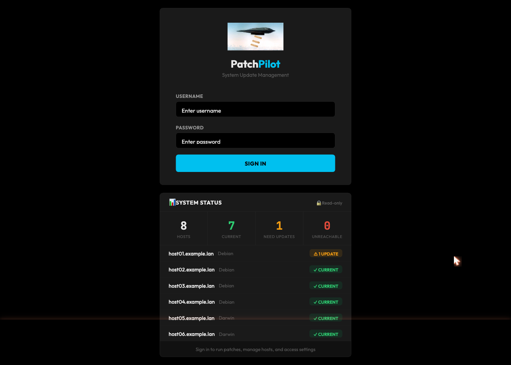

Once you sign in, you land on the dashboard:

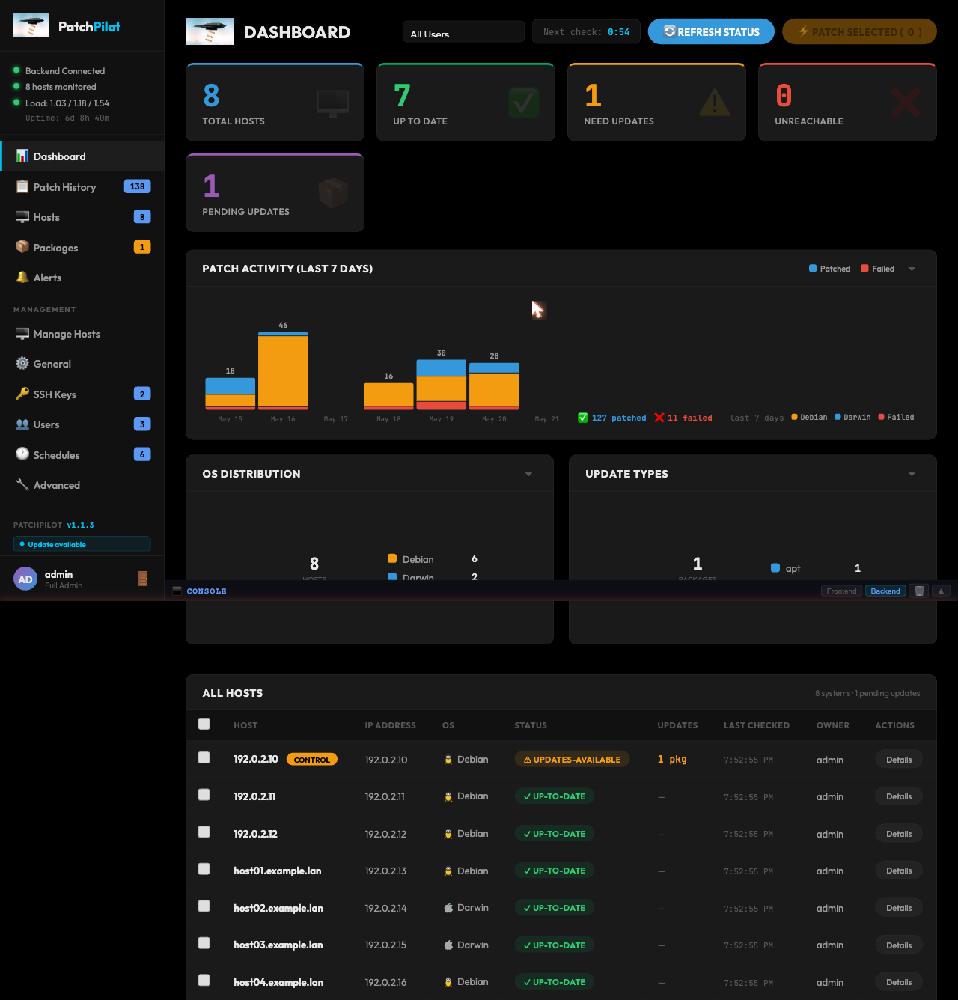

The home screen:

- **Stats cards** — Up to date / Need updates / Unreachable / Total pending packages.
- **Host table** — hostname, OS, status badge, pending update count, last checked, action menu.
- **Sidebar** — Dashboard, Settings, optional update-available badge.
- **Countdown** — seconds until the next background check.

Click any hostname to open **Host Details**: per-host package list (current → available version), patch history, last error, "Patch Now" and "Check Now" buttons.

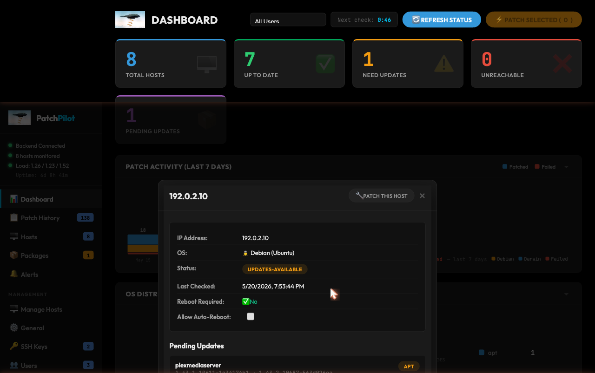

Status badges:

| Badge | Meaning |
|---|---|
| `ok` | Reachable, no pending updates |
| `needs_updates` | Reachable, pending packages |
| `reboot_required` | Patched, waiting on a reboot |
| `unreachable` | SSH failed (timeout, auth, DNS) |
| `unknown` | Never successfully checked |

## 13. SSH keys library

**Settings → SSH Keys.** Save a key once, reuse it across hosts.

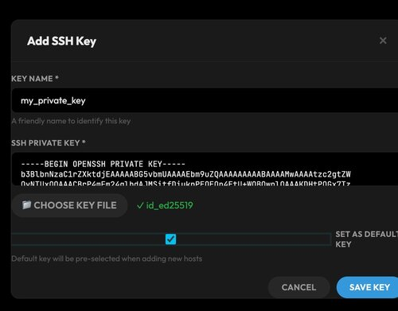

To add: click **Add SSH Key**, paste the private key (or upload a file), give it a name (e.g. `homelab-ed25519`), optionally **Set as default**. Keys are Fernet-encrypted before they hit the DB.

You can also paste/upload a key inline on the Add Host form without saving it to the library — but you'll have to re-paste it for every host. Save it.

Per-RBAC: Admins see their own keys only; Full Admin sees everyone's.

At patch time, the backend decrypts the key, writes it to a `0600` temp file, hands the path to Ansible, and deletes it after the run. The plaintext key never touches disk longer than the patch run.

## 14. Adding hosts

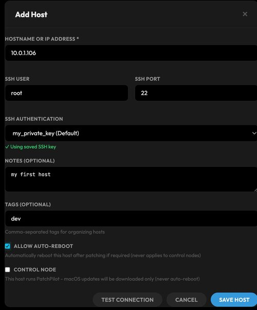

**Settings → Hosts → Add New Host.** Required fields:

- **Hostname** — FQDN or IP. Globally unique.
- **SSH user** — defaults to your fleet default (`root` typically; for PatchPilot v1.1.0+ Linux/Windows, this is `patchpilot`).
- **SSH port** — usually 22.
- **Authentication** — pick a saved key (recommended), paste a key inline, upload a key file, or use an SSH password.

Optional:
- **Notes**, **tags**
- **Auto-reboot on patch** — if true, the playbook will reboot when a kernel/system update demands it.

Click **Test Connection** before saving. PatchPilot SSHes directly (not via Ansible, for faster feedback) and reports success plus the detected OS family (`Darwin`, `Debian`, `RedHat`, `Windows`).

After saving, a single-host check runs within ~30 seconds. The new host appears with `unknown` status and transitions to `ok` / `needs_updates` once the check finishes.

> **macOS hosts:** the SSH user is the **operator's macOS account** (the human's user), not a service user. This is intentional — Apple ID and `mas` are tied to the GUI-logged-in user. macOS hosts will typically need a sudo password at patch time; everything else won't.

## 15. Onboarding Linux & Windows hosts

For Linux and Windows hosts, PatchPilot needs a dedicated service user (`patchpilot`) with a scoped `NOPASSWD: SETENV:` sudoers rule for the package manager + reboot/shutdown. The **Add Host** dialog gives you copy-paste bootstrap snippets.

### Linux

The bootstrap script (run as root on the target):

1. Creates the `patchpilot` system user (no login shell).
2. Adds PatchPilot's public key to `~patchpilot/.ssh/authorized_keys`.
3. Writes `/etc/sudoers.d/patchpilot` with NOPASSWD scoped to the host's package manager (`apt-get` / `dnf` / `yum` / `zypper` / `pacman`), `reboot`, `shutdown`, and `/bin/sh` + `/bin/bash`. The shells are required because Ansible's `become` wraps every task in `sudo -n /bin/sh -c '...'`; effective privilege is unchanged from already allowing the package manager (which can install arbitrary packages). Still **not** `ALL=(ALL) NOPASSWD: ALL` in form, and not the kitchen-sink wheel-group entry.

Once it runs, the Linux host needs no sudo password from PatchPilot. Leave the "Shared SUDO Password" field blank on schedules and Patch Now dialogs.

### Windows

The PowerShell snippet (`Enable-PatchPilotSSH.ps1`) — run from an elevated PowerShell on the target:

1. Creates the `patchpilot` user.
2. Enables OpenSSH Server.
3. Installs the `PSWindowsUpdate` module (if `winupdate_enabled` is on).
4. Registers the scheduled task that lets PatchPilot trigger Windows Update runs.

### macOS

macOS hosts don't use the bootstrap script. You SSH in as the operator's own user. Write a sudoers fragment at `/etc/sudoers.d/patchpilot`:

```
operator ALL=(root) NOPASSWD: SETENV: /opt/homebrew/bin/mas, /usr/sbin/softwareupdate, /sbin/reboot, /sbin/shutdown
```

(Adjust the `mas` path for Intel Macs: `/usr/local/bin/mas`.)

For Homebrew **cask** installs that prompt for sudo, PatchPilot uses a file-based askpass mechanism to feed the password securely.

## 16. Checking for updates

Three ways:

- **Background periodic check** — runs every `refresh_interval` seconds (default 300). All hosts checked in parallel. Set the interval to 0 to disable.
- **Manual full-fleet check** — click **Refresh Status** on the dashboard. Equivalent to `POST /api/check`.
- **Single-host check** — on a host's row or detail page, **Check Now**. Equivalent to `POST /api/check/{hostname}`. Auto-triggered when you add a host.

A module-wide lock prevents concurrent checks from running (a second Ansible process would exhaust SSH `ControlMaster` slots and falsely report hosts as unreachable). If a check is already running, the second request is queued or rejected.

A check that's been "running" for more than 45 minutes is auto-cleared to `error` so the UI doesn't hang forever.

## 17. Patching

From the host table: select one or more hosts with the checkboxes → **Patch Selected**. Or from a single host's detail page: **Patch Now**.

The dialog asks for:

- **Sudo password** — *optional in v1.1.4+*. Required only if a selected host actually prompts for sudo (typically macOS — see [§14](#14-onboarding-linux--windows-hosts)). Leave blank for Linux/Windows hosts onboarded via the bootstrap script.

Click **Start Patching**. A modal opens with live Ansible task output streamed over a WebSocket — task name, target host, line-by-line stdout, per-task timestamps. You can close the modal; the patch keeps running.

When the run finishes:

- An immediate re-check runs against the patched hosts.
- The dashboard auto-refreshes.
- Patch history records duration, packages installed, exit status.

**Control node protection:** the host that's running PatchPilot itself is flagged `is_control_node=true`. The playbook will warn you and **never** auto-reboot it, even if `allow_auto_reboot` is true on the host record.

## 18. Scheduled patch windows

**Settings → Schedules → Add Schedule.**

- **Name** — human label (e.g. `Sunday 2 AM kernel patch`).
- **Days of week** — comma-separated (`monday,wednesday,friday`).
- **Start / end time** — `HH:MM` 24-hour format, evaluated in the configured `schedule_timezone`.
- **Auto-reboot** — apply reboots if needed.
- **Shared SUDO password** — *optional, v1.1.4+*. Needed only if any selected host actually prompts for sudo (typically macOS).
- **Hosts** — pick from your fleet.

The scheduler loop runs continuously, checks every minute, and triggers a patch as soon as `now` enters a scheduled window on a scheduled day. `last_run` and `last_status` (`success` / `partial` / `error` / `running`) are tracked per schedule.

Admins see their own schedules; Full Admin sees all.

## 19. Package exclusions

Some updates you don't want PatchPilot to touch — known-bad versions, packages you pin manually, the macOS Xcode CLI update that takes 40 minutes.

**macOS — App Store (`mas`):** Settings → macOS → **Excluded MAS IDs**. Find the numeric ID in the Pending Packages list (each row has a copy button), paste into the comma-separated list.

**macOS — `softwareupdate`:** Settings → macOS → **Excluded labels**. Use the label prefix shown in Pending Packages (e.g. `Command Line Tools for Xcode`) — prefix match, so all versions of that update are skipped.

**Windows — `winget`:** Settings → Windows → **Excluded Winget IDs**. Use the `Package.Id` (e.g. `Microsoft.Edge`).

**Linux:** apt/dnf/yum exclusions aren't surfaced in the UI. Use the package manager's native pin mechanisms (`apt-mark hold`, `dnf versionlock`) on the host itself.

## 20. The iOS app

A native SwiftUI client lives in `ios/`. Four tabs:

- **Dashboard** — live stats and host counts.
- **Hosts** — list every host, status, pending updates. Tap to view details and trigger a patch.
- **History** — past patch runs with timestamps and outcomes.
- **Settings** — server URL, session, log out.

Authentication: enter your PatchPilot URL and a Bearer token (generated in Settings → Users). Token and URL are stored in the iOS Keychain with `kSecAttrAccessibleAfterFirstUnlock` — persists across reboots, available only after the device is unlocked.

Real-time patch progress streams over WebSocket the same way as the web UI, so you can kick off a patch from your laptop and watch it from the train.

Distributed via TestFlight (active Apple Developer membership required for sideloading other ways).

## 21. Troubleshooting

### "Unreachable" on a host that's online

```bash
# Docker
docker exec -it patchpilot-backend-1 ssh -v user@host
# K3s
kubectl exec -n patchpilot deploy/patchpilot-backend -- ssh -v user@host
```

Common causes: wrong SSH user, key not yet copied to host, host firewall, host's `sshd` not running, DNS resolution failure inside the container.

### Patching fails: "permission denied"

The sudo password doesn't match the SSH user's password on the target. Test on the host: `sudo -v`.

If the host is supposed to be passwordless (Linux/Windows onboarded via the bootstrap script), check `/etc/sudoers.d/patchpilot` exists and is owned by `root:root` with mode `0440`.

### Backend won't start

```bash
docker compose logs backend
# or
kubectl logs -n patchpilot deploy/patchpilot-backend -c backend --tail=200
```

Look for: missing `PATCHPILOT_ENCRYPTION_KEY`, DB connection refused (Postgres still starting), or a corrupt restore.

### License flips back to "expired" 60 seconds after activation

Resolved in v1.1.2. Update PatchPilot.

### TLS certificate not issuing on K3s

```bash
kubectl describe cert patchpilot-tls -n patchpilot
kubectl logs -n cert-manager deploy/cert-manager | tail -50
```

Usually: Cloudflare token in the wrong namespace, wrong scope (needs `Zone → DNS → Edit`), or the domain doesn't actually resolve to your ingress IP.

### Dashboard shows tons of `Z` (zombie) processes / pod load average climbing

Resolved in v1.1.3 — `tini` is now PID 1 in the backend image to reap orphaned `ssh ControlMaster` children. Update PatchPilot.

### "Update Now" doesn't restart the backend

Docker mode: confirm the helper container actually spawned (`docker ps -a | grep patchpilot-updater`). If you see `ImagePullBackOff`-style errors, check that the new image tag exists on Docker Hub. v1.1.2+ uses `imagePullPolicy: IfNotPresent` so a deleted upstream tag won't strand you on restart.

### Logs are noisy / I need DEBUG

Settings → Advanced → toggle **Debug Mode** on. Takes effect immediately, no restart needed.

---

## API reference (for scripting)

Useful endpoints if you want to wire PatchPilot into other tooling:

```
# Hosts
GET/POST   /api/hosts
GET/PUT/DELETE /api/hosts/{id}

# Checks & patching
POST /api/check                # full fleet
POST /api/check/{hostname}     # single host
POST /api/patch                # body: {hostnames: [...], become_password?: "..."}

# Stats
GET  /api/stats

# Schedules
GET/POST /api/schedules
PUT/DELETE /api/schedules/{id}

# Updates
GET  /api/updates/status
POST /api/updates/check
POST /api/updates/apply

# Backup
GET  /api/backup/list
POST /api/backup/create
POST /api/backup/restore/{filename}

# License
GET  /api/license/status
POST /api/license/activate
POST /api/license/deactivate

# WebSocket — live patch output
WS   /ws/patch-progress
```

All endpoints require authentication except `/api/auth/login` and `/api/license/status`. Session cookie or Bearer token works. RBAC rules apply.

---

*Built for sysadmins who patch first and ask questions never.*
